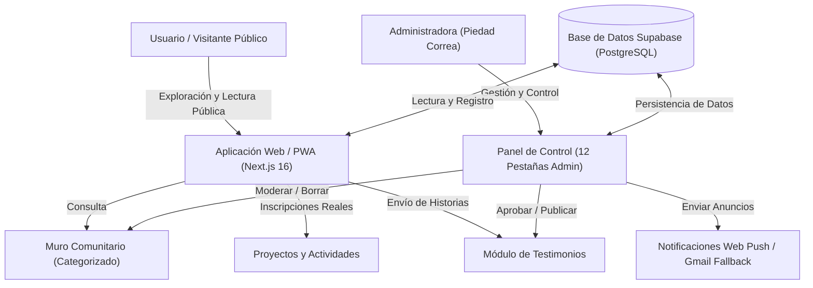

# INFORME DE PRESENTACIÓN E IMPACTO — TU HISTORIA EN MÍ
> **Documento Oficial para Patrocinadores, Auspiciadores, Iglesias y Fondos de Financiamiento**  
> **Fecha:** 16 de Julio de 2026 — **Versión del Software:** 4.0 (PWA)  
> **Autora y Directora:** M. Piedad Correa

---

## 1. Resumen Ejecutivo y Propósito Central

**Tu Historia en Mí** es una plataforma digital y comunitaria en formato de **Aplicación Web Progresiva (PWA)** diseñada como un canal de contención, fe y comunicación espiritual. El proyecto surge ante la necesidad de crear espacios seguros en internet donde las personas puedan compartir testimonios reales de fe, encontrar apoyo comunitario a través de la oración y nutrir su vida espiritual a diario.

El lema e inspiración del proyecto es:
> **"Porque cuando alguien se atreve a decirlo, otro se atreve a sentirlo."**

### El Propósito del Proyecto:
* **Conectar Testimonios Reales:** Utilizar el poder de la narrativa personal (podcast y testimonios escritos) como un agente de sanación, consuelo e inspiración para otros que atraviesan dificultades.
* **Comunión y Contención:** Brindar una red activa de apoyo espiritual donde se puedan publicar intenciones de oración, interactuar en un muro comunitario y participar en actividades presenciales o virtuales.
* **Crecimiento Diario:** Facilitar un espacio cotidiano de reflexión mediante versículos y devocionales interactivos diarios, promoviendo el hábito de la introspección y la oración personal.

---

## 2. Fundamento Psicológico y Espiritual

El proyecto no es solo una herramienta digital, sino que se sustenta en bases metodológicas y científicas de la **Psicología Narrativa** y la **Terapia de Aceptación y Compromiso (ACT)**:

1. **El Efecto Espejo y la Neurona Espejo:** Escuchar o leer cómo un hermano superó una crisis (una enfermedad, una pérdida, una depresión) activa una respuesta empática. Alivia el aislamiento emocional, recordándole a la persona: *"tu dolor no es único, no estás solo en esta lucha"*.
2. **Reencuadre Cognitivo (Reframing):** La narrativa testimonial enseña a reinterpretar las experiencias difíciles. El sufrimiento deja de verse como un callejón sin salida y pasa a integrarse como un proceso de aprendizaje con un propósito espiritual o de servicio a otros.
3. **Escritura Expresiva (Diario Espiritual):** El diseño de la plataforma promueve que los usuarios registren por escrito sus reflexiones íntimas sobre el devocional del día. Escribir acerca de nuestras vivencias y fe tiene beneficios documentados en la salud mental, al ayudar a estructurar y procesar emociones complejas.

---

## 3. Formatos de Contenido en la Plataforma

Para llegar a diversos públicos, **Tu Historia en Mí** distribuye su mensaje en tres formatos principales integrados en una sola plataforma:

### A. Podcast de Testimonios
* **Estructura:** Conversaciones íntimas guiadas por Piedad Correa, donde los invitados relatan su encuentro con Dios en momentos críticos de sus vidas.
* **Distribución Multicanal:** Cada episodio cuenta con un reproductor visual y enlaces directos que derivan a los usuarios a las principales plataformas de streaming de audio:
  * **Spotify** 🟢
  * **YouTube** 🔴
  * **Apple Podcasts** 🟣
  * **Amazon Music** 🟠
* **Métricas Integradas:** El sistema registra de manera automática cada clic realizado a las plataformas de audio, permitiendo evaluar cuantitativamente qué episodios y canales tienen mayor alcance.

### B. Devocionales Diarios Interactivos
* **Contenido:** Una reflexión diaria basada en un versículo de la Biblia y una oración guiada para iniciar el día.
* **Interactividad:** Los usuarios pueden responder a una pregunta de aplicación práctica directamente en la página del devocional.
* **Muro de la Comunidad:** Al responder, el usuario tiene la opción de compartir su reflexión públicamente en el muro con un solo clic, fomentando el diálogo y el testimonio vivo cotidiano.

### C. Muro Comunitario Unificado
* **El Corazón de la Red:** Un feed cronológico público donde se centralizan las publicaciones del ministerio.
* **Categorización Dinámica:** Las publicaciones están divididas en 4 pilares:
  * **General 📝:** Mensajes de fe, avisos o pensamientos del día.
  * **Oración 🙏:** Intenciones específicas para las cuales la comunidad puede rezar en conjunto.
  * **Reflexión 💬:** Pensamientos más profundos en base a devocionales o vivencias personales.
  * **Sugerencia 🎤:** Espacio donde los usuarios proponen temas o invitados para el podcast.

---

## 4. Proyectos y Actividades Comunitarias

La plataforma va más allá de la lectura pasiva. Integra un **Calendario de Proyectos y Actividades** interactivo donde el ministerio publica talleres, jornadas de oración y voluntariados:

* **Inscripción con un Clic:** Los usuarios registrados pueden unirse a cualquier actividad disponible (talleres presenciales, grupos de estudio bíblico, ayuda social). El sistema actualiza automáticamente el contador de participantes visibles en la tarjeta.
* **Flexibilidad Administrativa:** El Panel de Administración permite publicar proyectos sin fechas rígidas (usando etiquetas dinámicas como *"Por confirmar"* o *"Pendiente"*), facilitando la organización previa y el reclutamiento de voluntarios.
* **Registro Opcional de Imágenes:** Las actividades pueden ser publicadas con imágenes personalizadas o usar la imagen institucional por defecto, asegurando un diseño estético y limpio incluso si no se cuenta con material fotográfico inmediato.

---

## 5. Arquitectura Técnica y Flujo del Proyecto

La aplicación fue desarrollada utilizando tecnologías web de última generación para asegurar máxima velocidad en dispositivos móviles, compatibilidad SEO y facilidad de moderación.

### Diagrama de Arquitectura y Flujos:

---

## 6. Canales de Auspicio, Patrocinio y Retorno Social

Para garantizar la sustentabilidad económica del proyecto y justificar el patrocinio de empresas e instituciones, **Tu Historia en Mí** cuenta con múltiples espacios de visibilidad de marca y métricas de impacto:

### 1. Cabecera del Devocional Diario (Patrocinio Premium)
El devocional diario es la sección de mayor tráfico recurrente en el Home. Permite vincular un auspiciador específico (`sponsor_id`), mostrando su logotipo, mensaje de patrocinio y enlace directo a su web.

### 2. Tarjetas de Auspicio en Detalle de Episodios
Cada episodio del podcast puede tener un patrocinador exclusivo. Al ingresar a los detalles del episodio, se despliega un banner destacado: *"Patrocinado por [Nombre de la Marca]"* con redirección a su sitio comercial.

### 3. Barra de Metas de Financiamiento Activa
En la página de **Donaciones** (`/donar`) y en el Home, se integra una barra de progreso que lee directamente de Supabase los montos actuales recaudados frente a la meta del mes. Esto brinda total transparencia a los donantes y muestra el estado en tiempo real.

### 4. Notificaciones Push Segmentadas y Broadcast
La plataforma posee un canal de mensajería Push. En el Panel Admin, se pueden enviar mensajes masivos directamente a la pantalla o celular de los suscriptores. Admite segmentación por tipo (ej. mandar un agradecimiento a auspiciadores solo a quienes activaron "Anuncios").

---

## 7. Evaluación de Impacto (Métricas del Administrador)

El sistema cuenta con un motor de analíticas internas (sin depender de cookies invasivas de terceros) que entrega datos concretos y transparentes sobre la tracción del proyecto en su panel administrativo:

| Indicador Métrico | Significado y Utilidad | Impacto Social Medido |
|-------------------|-------------------------|------------------------|
| **Visitas Totales** | Registra cada página vista de forma agregada. | Permite medir el tráfico general del sitio y picos de interés. |
| **Reproducciones por Plataforma** | Cuantifica los clics derivados a Spotify, YouTube, Apple y Amazon. | Demuestra qué plataformas y episodios prefiere la audiencia. |
| **Usuarios Registrados** | Perfiles activos con nombre, país y datos demográficos. | Evidencia la base comunitaria real comprometida con el proyecto. |
| **Reacciones en Comunidad** | Interacciones multi-emoji (🙏❤️😊✨) en el Muro. | Mide el nivel de empatía activa (cuántos rezan y apoyan las causas). |
| **Voluntarios en Actividades** | Contador real de inscritos en proyectos. | Cuantifica la fuerza de voluntariado y el impacto directo en la sociedad. |

---

## 8. Proyecciones Futuras y Escalabilidad

El software ha sido diseñado con bases sólidas para permitir una expansión progresiva:

* **PWA Multiplataforma:** La app puede instalarse en teléfonos Android y iPhone directamente desde el navegador sin pasar por las tiendas de aplicaciones, reduciendo costos de mantenimiento.
* **Geolocalización Comunitaria:** Capacidad de segmentar el muro y actividades según el país o ciudad del perfil del usuario, abriendo la puerta a "capítulos" o grupos locales en toda Latinoamérica.
* **Alianzas Estratégicas:** El Panel de Administración de auspiciadores está listo para alojar logos y enlaces de patrocinadores recurrentes, ideal para vender espacios de publicidad social en devocionales y episodios.

---

## 9. Estado Actual del Software (Sprint 4)

El desarrollo tecnológico de la plataforma se encuentra **100% completo, verificado y optimizado para producción** en su versión 4.0:

> [!IMPORTANT]
> **Hito Técnico Alcanzado:**  
> La aplicación se compila exitosamente a código de producción Next.js sin advertencias ni errores en el tipado de TypeScript. Todo el flujo de base de datos para login, consentimiento de políticas, muro dinámico, notificaciones automáticas y panel admin de 12 pestañas se encuentra codificado y listo para ser utilizado en Supabase y Vercel.
