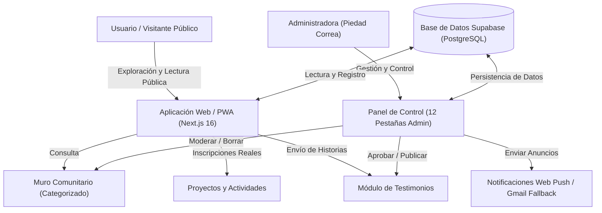

# INFORME DE PRESENTACIÓN E IMPACTO — TU HISTORIA EN MÍ
> **Documento Oficial para Patrocinadores, Auspiciadores, Iglesias y Fondos de Financiamiento**  
> **Fecha:** 17 de Julio de 2026 — **Versión del Software:** 4.1 (PWA)  
> **Autora y Directora:** M. Piedad Correa

---

## 1. Resumen Ejecutivo y Propósito Central

**Tu Historia en Mí** es mucho más que una plataforma digital; es una búsqueda activa de encuentro, unión y contención espiritual a través de testimonios reales de fe. El proyecto nace del deseo profundo de compartir cómo Dios se hace presente en la vida cotidiana de las personas, permitiéndonos resignificar nuestra propia fe al escuchar las vivencias de otros. 

El corazón del proyecto y su pilar fundamental siguen siendo los **Podcasts de testimonios**. A través de ellos, se genera un impacto único cuando un oyente escucha cómo Dios le habla a otra persona en sus momentos de prueba, enfermedad o superación, motivando a que cada quien aprecie el paso de Dios en su propia historia.

El camino del proyecto tiene una historia de evolución orgánica:
1. **Podcast (Pilar Principal):** Comenzó como un podcast de testimonios donde se comparte cómo pasa la mano de Dios por nuestras vidas, el cual sigue siendo nuestro pilar central y canal de evangelización principal.
2. **Espacio de Encuentro PWA:** Hoy se proyecta hacia el futuro como un espacio integral de comunidad que une la web, el podcast, las redes sociales y las instancias de encuentro presencial o actividades comunitarias directas.

El lema que guía cada acción es:
> **"Porque cuando alguien se atreve a decirlo, otro se atreve a sentirlo."**

### El Propósito del Proyecto:
* **Conectar Testimonios de Fe (El Podcast):** Utilizar la narrativa del podcast como la herramienta de evangelización principal para inspirar, consolar y mostrar el paso real de Dios por la vida de las personas.
* **Comunión y Contención en Redes:** Integrar una red de acompañamiento activa que incluye la plataforma web, el **Instagram oficial (`@tuhistoria.enmi`)** y **grupos de WhatsApp**, permitiendo una comunicación cotidiana y el apoyo mutuo en oración.
* **Espacios de Oración y Encuentro:** Facilitar instancias presenciales, eventos sociales y actividades comunitarias diseñadas para unir a los miembros y construir lazos de fe sólidos.

---

## 2. Fundamento Psicológico y Espiritual

El proyecto se sustenta en bases metodológicas y científicas de la **Psicología Narrativa** y la **Terapia de Aceptación y Compromiso (ACT)**:

1. **El Efecto Espejo y la Neurona Espejo:** Escuchar cómo otra persona superó una crisis (una enfermedad, una pérdida, una depresión) activa una respuesta empática. Alivia el aislamiento emocional, recordándole al oyente que no está solo en sus dificultades y desafíos de la vida, y que la gracia de Dios actúa en lo cotidiano.
2. **Reencuadre Cognitivo (Reframing):** La narrativa testimonial enseña a reinterpretar las experiencias difíciles. El sufrimiento deja de verse como un callejón sin salida y pasa a integrarse como un proceso de aprendizaje con un propósito espiritual o de servicio a otros.
3. **Escritura Expresiva (Diario Personal Privado):** El diseño promueve el uso del diario íntimo. Escribir acerca de nuestras vivencias y fe ayuda a estructurar y procesar emociones complejas de forma privada.

---

## 3. Formatos de Contenido en la Plataforma

Para llegar a diversos públicos, **Tu Historia en Mí** distribuye su mensaje en tres formatos principales integrados en una sola plataforma:

### A. Podcast de Testimonios (Pilar Central)
* **Estructura:** Conversaciones íntimas guiadas por Piedad Correa, donde los invitados relatan su encuentro con Dios en momentos críticos de sus vidas.
* **Distribución Multicanal:** Cada episodio cuenta con un reproductor visual y enlaces directos que derivan a los usuarios a las principales plataformas de streaming de audio:
  * **Spotify** 🟢
  * **YouTube** 🔴
  * **Apple Podcasts** 🟣
  * **Amazon Music** 🟠
* **Métricas Integradas:** El sistema registra de manera automática cada clic realizado a las plataformas de audio, permitiendo evaluar cuantitativamente qué episodios y canales tienen mayor alcance.

### B. Diario Personal Privado (Exclusivo para el Usuario)
* **Escritura Íntima:** Un diario interactivo diseñado específicamente para que los usuarios escriban sus reflexiones, pensamientos y oraciones cotidianas de manera personal.
* **Privacidad Absoluta:** Las entradas del diario son de carácter estrictamente privado (solo para ellos) y no son compartidas en el muro público ni visibles para terceros, brindando un espacio seguro de introspección espiritual.
* **Soporte Local y en la Nube:** Permite registrar notas de forma inmediata (en el almacenamiento del dispositivo si es un invitado, o sincronizadas en su perfil de Supabase si es un miembro registrado).

### C. Muro Comunitario e Integración Social
* **El Corazón de la Red:** Feed público donde se centralizan las intenciones de oración, reflexiones compartidas y pensamientos de fe.
* **Puentes de Comunidad (WhatsApp e Instagram):** Enlaces e invitaciones visibles para derivar a los usuarios a los canales comunitarios activos. En Instagram se comparte el contenido visual diario y en WhatsApp se coordinan peticiones urgentes de oración y anuncios directos.

---

## 4. Proyectos, Actividades e Instancias de Encuentro

La plataforma va más allá de la lectura pasiva. Integra un **Calendario de Proyectos y Actividades** interactivo donde el ministerio publica talleres, jornadas de oración y voluntariados:

* **Inscripción con un Clic:** Los usuarios registrados pueden unirse a cualquier actividad disponible (talleres presenciales, grupos de estudio bíblico, ayuda social). El sistema actualiza automáticamente el contador de participantes visibles en la tarjeta.
* **Flexibilidad Administrativa:** El Panel de Administración permite publicar proyectos sin fechas rígidas (usando etiquetas dinámicas como *"Por confirmar"* o *"Pendiente"*), facilitando la organización previa y el reclutamiento de voluntarios.

---

## 5. Arquitectura Técnica y Flujo del Proyecto

La aplicación fue desarrollada utilizando tecnologías web de última generación para asegurar máxima velocidad en dispositivos móviles, compatibilidad SEO y facilidad de moderación.

### Diagrama de Arquitectura y Flujos:

---

## 6. Sustentabilidad y Financiamiento: Tienda Solidaria y Auspicios

Para garantizar la sustentabilidad económica del proyecto y justificar el patrocinio de empresas e instituciones, **Tu Historia en Mí** cuenta con múltiples espacios de visibilidad de marca y métricas de impacto:

### 1. Tienda Solidaria (Financiamiento y Evangelización Activa)
* **Merchandising de Fe:** Se proyecta un espacio de venta de poleras, polerones y accesorios oficiales de la comunidad.
* **Frases Escogidas por la Comunidad:** Las estampas llevarán frases icónicas extraídas del podcast, las cuales serán escogidas democráticamente por los mismos miembros.
* **Doble Propósito:** Este espacio permite **financiar de forma independiente y sustentable** la producción del podcast y los costos del servidor, mientras que a la vez sirve como una vía de **evangelización activa** al vestir y compartir el mensaje en el día a día.

### 2. Auspicios Estratégicos e Impacto
* **Cabecera del Devocional Diario:** Permite vincular un auspiciador específico (`sponsor_id`), mostrando su logotipo, mensaje de patrocinio y enlace directo.
* **Tarjetas de Auspicio en Episodios:** Cada episodio del podcast puede tener un patrocinador exclusivo que se despliega al revisar los detalles del episodio.
* **Barra de Metas de Financiamiento Activa:** Muestra el progreso de las donaciones mensuales de forma transparente, consultando los datos en tiempo real de la base de datos.

---

## 7. Marco de Términos Legales y Limitación de Responsabilidad

El registro y participación en **Tu Historia en Mí** está regulado por un flujo de consentimiento explícito (Términos de Uso y Políticas de Privacidad) diseñado para proteger tanto a los usuarios como al ministerio:

* **Aceptación Obligatoria:** Cada usuario que inicia sesión debe aceptar de forma explícita los términos legales mediante un modal de consentimiento en su primer acceso.
* **Uso Adecuado del Espacio:** Queda establecido que el Muro Comunitario es un espacio para compartir de forma constructiva en torno a la fe. El ministerio se reserva el derecho de moderar o eliminar publicaciones que incumplan las normas comunitarias.
* **Deslinde de Responsabilidad (Limitation of Liability):** Los términos legales especifican claramente que la plataforma facilita un canal de comunicación y apoyo comunitario, pero **el ministerio y su directiva no se hacen responsables** frente a disputas, desacuerdos, incidentes o problemas que ocurran entre los usuarios (ya sea de forma digital o en encuentros presenciales derivados de la plataforma). Cada participante asume la responsabilidad de su interacción social.

---

## 8. Evaluación de Impacto (Métricas del Administrador)

El sistema cuenta con un motor de analíticas internas (sin depender de cookies invasivas de terceros) que entrega datos concretos y transparentes sobre la tracción del proyecto en su panel administrativo:

| Indicador Métrico | Significado y Utilidad | Impacto Social Medido |
|-------------------|-------------------------|------------------------|
| **Visitas Totales** | Registra cada página vista de forma agregada. | Permite medir el tráfico general del sitio y picos de interés. |
| **Reproducciones por Plataforma** | Cuantifica los clics derivados a Spotify, YouTube, Apple y Amazon. | Demuestra qué plataformas y episodios prefiere la audiencia. |
| **Usuarios Registrados** | Perfiles activos con nombre, país y datos demográficos. | Evidencia la base comunitaria real comprometida con el proyecto. |
| **Reacciones en Comunidad** | Interacciones multi-emoji (🙏❤️😊✨) en el Muro. | Mide el nivel de empatía activa (cuántos rezan y apoyan las causas). |
| **Voluntarios en Actividades** | Contador real de inscritos en proyectos. | Cuantifica la fuerza de voluntariado y el impacto directo en la sociedad. |

---

## 9. Estado Actual del Software (Sprint 4)

El desarrollo tecnológico de la plataforma se encuentra **100% completo, verificado y optimizado para producción** en su versión 4.1:

> [!IMPORTANT]
> **Hito Técnico Alcanzado:**  
> La aplicación se compila exitosamente a código de producción Next.js sin advertencias ni errores en el tipado de TypeScript. Todo el flujo de base de datos para login, consentimiento de políticas, muro dinámico, devocional colapsable con sistema anti-caché de datos en vivo, y diario personal en el perfil del usuario está codificado y listo para ser utilizado en Supabase y Vercel.

---

## 10. Proyección de Costos de Operación y Lanzamiento Móvil (Android & iOS)

Para escalar el proyecto y dar el salto oficial a los dispositivos móviles de manera nativa (facilitando su descarga directa desde las tiendas de Google y Apple), se proyecta el siguiente presupuesto operativo. Esto justifica y sustenta la búsqueda activa de auspiciadores, patrocinadores institucionales y el lanzamiento de la Tienda Solidaria:

### A. Costos Únicos de Lanzamiento y Licencias de Tiendas
* **Google Play Developer Console (Android):** **$25 USD** *(aprox. $23.750 CLP)* (Pago único para habilitar la subida ilimitada de apps de Android).
* **Apple Developer Program (iOS/App Store):** **$99 USD / año** *(aprox. $94.000 CLP / año)* (Suscripción anual obligatoria requerida por Apple para publicar apps en iPhones e iPads).
* **Dominio Personalizado Oficial:** **$15 USD / año** *(aprox. $14.250 CLP / año)* (Costo aproximado de renovación anual del dominio web).

### B. Costos Mensuales de Infraestructura Digital y Mantenimiento
*(Nota: Actualmente el proyecto opera bajo planes de hosting y servidores gratuitos con límites básicos. Esta proyección contempla migrar a servidores profesionales pagados para garantizar estabilidad, velocidad de carga y soporte para miles de usuarios activos sin límites de tráfico).*
* **Servicios de Servidor y Base de Datos (Supabase Pro Tier):** **$25 USD / mes** *(aprox. $23.750 CLP / mes)*  
  *(Cubre almacenamiento de base de datos, fotos de perfil de usuarios y tráfico para hasta 100,000 usuarios activos).*
* **Alojamiento y Red de Distribución (Vercel Pro):** **$20 USD / mes** *(aprox. $19.000 CLP / mes)*  
  *(Asegura velocidad óptima de carga, seguridad avanzada y soporte de despliegue continuo sin caídas).*
* **Soporte de Notificaciones Web Push y Mensajería:** **$0 - $10 USD / mes** *(hasta $9.500 CLP / mes)*  
  *(Envío automático de versículos y anuncios diarios directo a los celulares de los usuarios).*
* **Herramientas de Edición y Hosting de Podcast:** **$12 USD / mes** *(aprox. $11.400 CLP / mes)*  
  *(Distribución multicanal de audio e hosting del feed oficial del podcast).*
* **Publicidad y Promoción (Instagram, Facebook y Spotify Ads):** **$30 USD / mes** *(aprox. $28.500 CLP / mes)*  
  *(Presupuesto mensual base de anuncios para promocionar los nuevos episodios y expandir el alcance de los testimonios).*

### C. Resumen de Financiamiento Requerido

*(Valores calculados bajo tasa referencial estimada de 1 USD = $950 CLP)*

| Tipo de Gasto | Detalle del Concepto | Costo Estimado (USD) | Costo Estimado (CLP) | Frecuencia |
|---|---|---|---|---|
| **Lanzamiento Móvil** | Licencia única Google Play Store | **$25 USD** | **$23.750 CLP** | Una sola vez |
| **Mantención Tienda Apple** | Licencia de desarrollador iOS | **$99 USD** | **$94.000 CLP** | Anual |
| **Dominio Web** | Renovación del dominio personalizado | **$15 USD** | **$14.250 CLP** | Anual |
| **Servidores & Base de Datos** | Supabase Pro & Vercel Hosting | **$45 USD** | **$42.750 CLP** | Mensual |
| **Distribución de Podcast** | Hosting y herramientas de edición | **$12 USD** | **$11.400 CLP** | Mensual |
| **Publicidad y Promoción** | Campañas de anuncios en plataformas | **$30 USD** | **$28.500 CLP** | Mensual |

---

> [!TIP]
> **Estrategia de Financiamiento Sostenible:**  
> Gracias a que el software fue programado usando **Capacitor (híbrido)**, se evitan los miles de dólares de costo de desarrollo de software desde cero que cobraría una agencia por programar dos apps móviles independientes. Toda la lógica web de Next.js se reutiliza. El financiamiento buscado se destinará exclusivamente a los **costos operativos descritos arriba** y a la producción y marketing del podcast, lo cual se autofinanciará a través de la venta en la **Tienda Solidaria** y los **auspicios en el Devocional Diario**.
