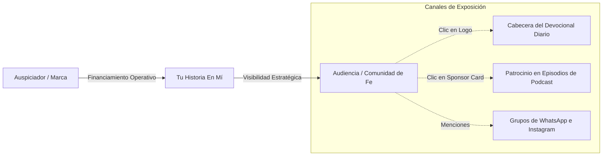

# PROPUESTA DE FINANCIAMIENTO Y PATROCINIO — TU HISTORIA EN MÍ
> **Documento para Presentación a Auspiciadores, Empresas y Donantes Estratégicos**  
> **Directora del Proyecto:** M. Piedad Correa  
> **Contacto Oficial:** piti.coal@gmail.com  
> **Plataforma Web (PWA):** [tuhistoriaenmi.vercel.app](https://tuhistoriaenmi.vercel.app)

---

## 1. Lo Que se Busca (Nuestra Misión y Visión)

**Tu Historia en Mí** no es solo una página web ni un canal digital; es un espacio de contención, evangelización activa y encuentro comunitario. A través de testimonios reales de fe, buscamos:

* **Compartir el Paso de Dios por la Vida Cotidiana:** Mostrar a través de relatos vividos e íntimos de personas reales cómo la mano de Dios actúa en momentos de dificultad, enfermedad, pérdida y superación.
* **Resignificar la Fe en el Día a Día:** Vivir y compartir la fe de manera constructiva, demostrando que la fe no es teórica sino práctica, dinámica y transformadora.
* **Acompañamiento y Contención Espiritual:** Brindar un espacio seguro donde los usuarios nunca se sientan solos ante las dificultades de la vida, fomentando la empatía mutua a través de la oración en comunidad.
* **Expansión a Aplicaciones Móviles:** Publicar la aplicación directamente en **Google Play Store** y **Apple App Store** para que cualquier persona en Chile y Latinoamérica pueda descargarla con un clic y recibir apoyo espiritual en su bolsillo de manera nativa.

---

## 2. Lo Que se Tiene / Lo Que Hay (Activos del Proyecto)

El proyecto ya cuenta con una infraestructura tecnológica robusta y completa, desarrollada al 100% y lista para producción, lo que significa **cero costos de desarrollo pendientes**:

* **Aplicación Web y Móvil (PWA) Terminada:** Una plataforma optimizada y responsive para computadores y celulares, con animaciones premium y bloqueo de escala móvil para un comportamiento nativo.
* **El Podcast (Pilar Central):** Módulo de episodios completamente codificado, conectado con enlaces interactivos directos a las principales redes de streaming: Spotify, YouTube, Apple Podcasts y Amazon Music.
* **Diario Personal Privado:** Un espacio privado integrado en el perfil de cada usuario que les permite escribir sus notas y oraciones diarias de forma 100% íntima y segura en la base de datos.
* **Muro de Oración y Comunidad:** Un feed interactivo con reacciones multi-emoji (🙏❤️😊✨) donde los usuarios comparten reflexiones públicas, y accesos directos al grupo de WhatsApp y el Instagram oficial.
* **Panel de Administración Completo (12 Pestañas):** Un centro de control exclusivo para la directora (Piedad Correa) que le permite moderar el muro, subir episodios, programar devocionales diarios y enviar notificaciones automáticas (Push) a los celulares de los usuarios.
* **Sistema de Auspicios Dinámicos Ya Codificado:** La plataforma ya está preparada técnicamente para colocar los logotipos y enlaces de los auspiciadores en las secciones más vistas del sitio.

---

## 3. Lo Que se Necesita (Presupuesto Requerido)

Actualmente, el proyecto se sostiene en servidores y servicios gratuitos de prueba. Para poder dar el salto profesional, evitar caídas del servidor por exceso de usuarios y realizar el lanzamiento oficial en celulares, requerimos cubrir los siguientes gastos operativos:

*(Valores calculados bajo tasa referencial estimada de 1 USD = $950 CLP)*

### A. Costos Anuales y Únicos de Lanzamiento (Setup)
Estos costos permiten habilitar la publicación en las tiendas y registrar la marca digital:
* **Membresía Apple Developer (iOS App Store):** **$99 USD / año** *(aprox. $94.000 CLP / año)*.
* **Licencia de Desarrollador Google Play (Android):** **$25 USD** *(aprox. $23.750 CLP)* (Pago único).
* **Dominio Web Personalizado Oficial:** **$15 USD / año** *(aprox. $14.250 CLP / año)*.
* **Total Setup Inicial / Anual:** **$139 USD** *(aprox. $132.000 CLP)*.

### B. Costos Mensuales de Mantención e Infraestructura
Gastos mínimos para mantener el servicio activo, rápido y promocionar el contenido:
* **Servidor y Base de Datos Profesional (Supabase Pro):** **$25 USD / mes** *(aprox. $23.750 CLP / mes)*.
* **Hosting y Red de Distribución Segura (Vercel Pro):** **$20 USD / mes** *(aprox. $19.000 CLP / mes)*.
* **Distribución de Feed de Podcast y Herramientas:** **$12 USD / mes** *(aprox. $11.400 CLP / mes)*.
* **Publicidad y Promoción en Plataformas (Instagram & Spotify Ads):** **$30 USD / mes** *(aprox. $28.500 CLP / mes)*.
* **Total Operativo Mensual:** **$87 USD / mes** *(aprox. $82.650 CLP / mes)*.

---

## 4. Retorno para el Auspiciador (¿Qué Ofrecemos?)

Los auspiciadores del proyecto no solo realizan una donación filantrópica, sino que obtienen **presencia de marca estratégica y activa** en una comunidad de fe comprometida y con altas tasas de interacción:

### Espacios de Exposición Disponibles:
1. **Patrocinio del Devocional Diario (El espacio más visto):**
   * El logotipo y nombre del auspiciador aparecerá en la cabecera del Devocional del Día en la página de inicio.
   * Cuenta con un botón de redirección directa (*"Patrocinado por [Nombre]"*) que deriva tráfico directo a la web o redes sociales del auspiciador.
2. **Auspiciador de Episodio de Podcast:**
   * Cada episodio puede contar con una tarjeta de patrocinador dedicada en su vista de detalles, mostrando su apoyo a la difusión de ese testimonio específico.
3. **Menciones y Difusión en Comunidad:**
   * Menciones y agradecimientos en los grupos cerrados de WhatsApp oficiales y publicaciones conjuntas en la cuenta de Instagram `@tuhistoria.enmi`.
4. **Reportes de Analíticas Transparentes:**
   * La administradora tiene acceso a contadores exactos de visitas y clics de salida redirigidos a las marcas auspiciadoras, garantizando transparencia en la efectividad del patrocinio.

---

> [!IMPORTANT]
> **¿Por qué apoyar a Tu Historia En Mí?**  
> Es una inversión directa en contención humana, salud espiritual y evangelización activa. Al apoyar el proyecto, permites que miles de personas tengan acceso gratuito a testimonios que iluminan sus propias vidas en momentos de dificultad y a un diario personal donde encontrarse con Dios en el silencio del corazón.
