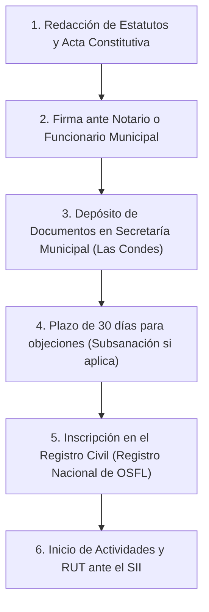

# GUÍA LEGAL: PASOS PARA CONSTITUIR LA FUNDACIÓN EN CHILE (MUNICIPALIDAD DE LAS CONDES)
> **Manual de Procedimiento Legal para la Creación de Personería Jurídica sin Fines de Lucro**

Esta guía detalla el procedimiento oficial y los requisitos prácticos para constituir legalmente la **Fundación "Tu Historia en Mí"** en la comuna de **Las Condes, Santiago, Chile**, de acuerdo con las reformas de la Ley N° 20.500 sobre Asociaciones y Participación Ciudadana en la Gestión Pública y las regulaciones del Código Civil chileno.

---

## 1. Concepto y Características Claves de una Fundación en Chile
Una **Fundación** es una persona jurídica sin fines de lucro, constituida mediante la afectación de un patrimonio (bienes o dinero) a un objeto de interés público o de beneficencia particular.
* **Sin fines de lucro:** Todos los ingresos generados (por la Tienda Solidaria, donaciones, auspicios) se deben reinvertir obligatoriamente en el cumplimiento de su objeto. No se pueden repartir utilidades a los fundadores ni al directorio.
* **Patrimonio Inicial Obligatorio:** A diferencia de una Corporación, una Fundación requiere la dotación de un patrimonio fundacional inicial (bienes materiales, software/plataforma web, o un monto de dinero en pesos chilenos).
* **Administración:** Está a cargo de un Directorio compuesto por al menos 3 miembros.

---

## 2. Paso a Paso del Trámite de Constitución en Las Condes

El procedimiento se realiza de forma simplificada a través de la **Secretaría Municipal de Las Condes**:

### Paso 1: Redacción de Estatutos y Acta
Se deben redactar los **Estatutos de la Fundación** y el **Acta de Constitución**. Estos documentos deben individualizar a la fundadora, los miembros del directorio provisorio, el objeto social y el patrimonio inicial (Ver borrador en el archivo `4_borrador_estatutos_fundacion.md`).

### Paso 2: Firma e Instrumento Jurídico
Hay dos alternativas legales para firmar los documentos de constitución:
* **Alternativa A (Recomendada): Escritura Pública ante Notario.** Se acude a una notaría en Las Condes (ej. Notaría Humberto Quezada, Notaría María Gloria Acharán, etc.) y se firma la escritura pública. El costo notarial aproximado varía entre $80.000 y $120.000 CLP.
* **Alternativa B: Copia Autorizada ante Notario o Ministro de Fe Municipal.** Se firma un instrumento privado ante notario público o directamente ante el Secretario Municipal (como Ministro de Fe gratuito de la Municipalidad de Las Condes).

### Paso 3: Depósito en la Secretaría Municipal de Las Condes
Se deben ingresar por Oficina de Partes los siguientes documentos dirigidos al **Secretario Municipal de Las Condes** (Dirección: Av. Apoquindo 3400, Las Condes):
1. Tres copias de la Escritura Pública de constitución (o instrumento privado autorizado).
2. Certificado de antecedentes penales de los miembros del Directorio provisorio (sin anotaciones).
3. Fotocopia de las cédulas de identidad de todos los constituyentes y directores.
4. Carta conductora solicitando el registro de la personería jurídica.

### Paso 4: Examen de Legalidad (Plazo de 30 días)
El Secretario Municipal de Las Condes y la Dirección de Asesoría Jurídica de la municipalidad revisan los estatutos en un plazo de **30 días hábiles**. 
* **Si hay observaciones:** Notificarán por carta certificada o correo electrónico los cambios legales que deben realizarse. Se tiene un plazo para subsanar los estatutos mediante una escritura de modificación.
* **Si no hay observaciones (o una vez subsanadas):** La Municipalidad emite un certificado que acredita que no se han formulado objeciones.

### Paso 5: Inscripción en el Registro Civil
La propia Municipalidad de Las Condes remitirá los antecedentes al **Servicio de Registro Civil e Identificación** para realizar la inscripción en el *Registro Nacional de Personas Jurídicas sin Fines de Lucro*. Una vez inscrito, se genera el Certificado de Vigencia oficial de la Fundación.

### Paso 6: Obtención de RUT e Inicio de Actividades ante el SII
Con el Certificado de Vigencia del Registro Civil:
1. Se ingresa al portal del **Servicio de Impuestos Internos (SII)** (sii.cl).
2. Se solicita el **RUT de Persona Jurídica** de la Fundación.
3. Se realiza el **Inicio de Actividades** bajo el giro de *Fundación/Organización sin fines de lucro*.
4. Se solicita la exención de impuestos para donaciones o el timbraje de documentos necesarios si corresponde.

---

## 3. Requisitos Claves y Datos Necesarios

Para rellenar y firmar el Borrador de Estatutos (`4_borrador_estatutos_fundacion.md`), necesitas definir los siguientes elementos:

1. **Constituyente (Fundadora):**
   * Nombre completo: María Piedad Correa.
   * Cédula de Identidad (RUT).
   * Domicilio comercial en la comuna de Las Condes.
2. **Directorio Provisorio Inicial (Mínimo 3 personas):**
   * **Presidenta:** M. Piedad Correa.
   * **Secretario(a):** *(Se necesita una persona de confianza, mayor de 18 años, chileno o extranjero con residencia)*.
   * **Tesorero(a):** *(Se necesita otra persona de confianza para manejar las cuentas)*.
   * *Nota: Los cargos del directorio son gratuitos por ley (ad honorem).*
3. **Patrimonio Inicial:**
   * Se sugiere declarar como patrimonio inicial la cantidad de **$200.000 CLP** en efectivo (que se depositará en la cuenta bancaria de la Fundación una vez creada) junto con la donación del **Software y Código Fuente de la plataforma Web/PWA "Tu Historia En Mí"** (valorado simbólicamente en $500.000 CLP). Esto le da solidez patrimonial inmediata a la fundación ante la municipalidad sin requerir un gran desembolso de dinero.

---

## 4. Beneficios Tributarios de Ser Fundación en Chile (Ley de Donaciones)
Una vez constituida, la Fundación puede postular a leyes de incentivo tributario para recibir aportes de empresas de Las Condes y todo Chile, otorgándoles beneficios tributarios (franquicias fiscales):
* **Ley de Donaciones con Fines Sociales (Ley N° 19.885):** Las empresas que donen a la fundación pueden rebajar hasta el 50% de la donación directamente de sus impuestos de Primera Categoría, y el otro 50% registrarlo como gasto tributario. Esto hace sumamente atractivo para los auspiciadores entregar financiamiento.
